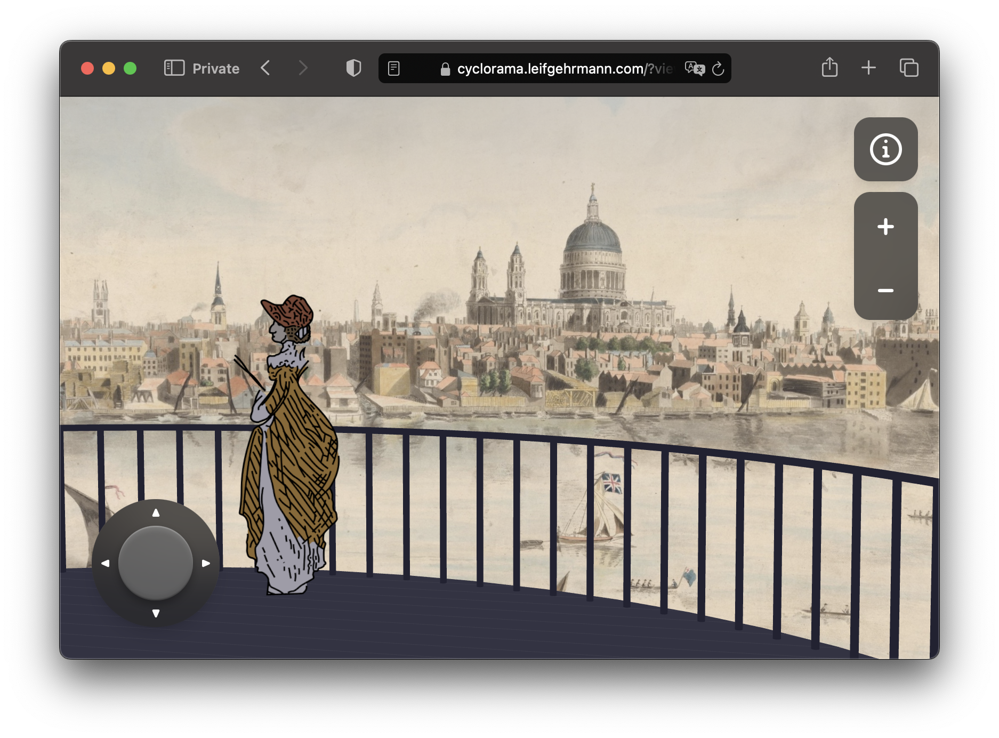
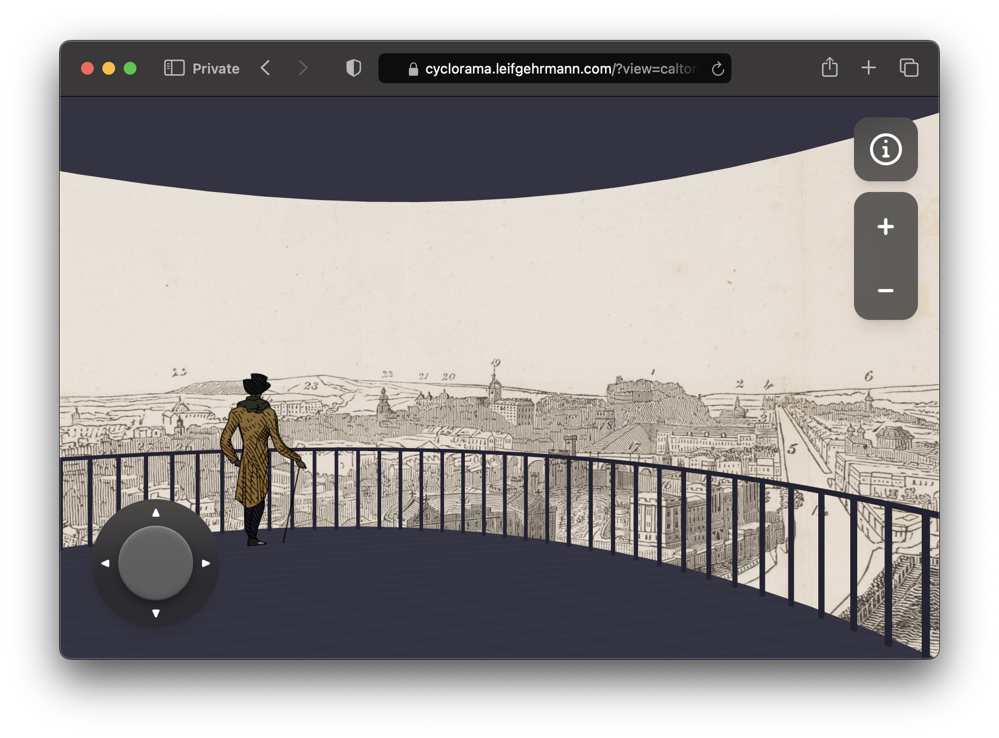
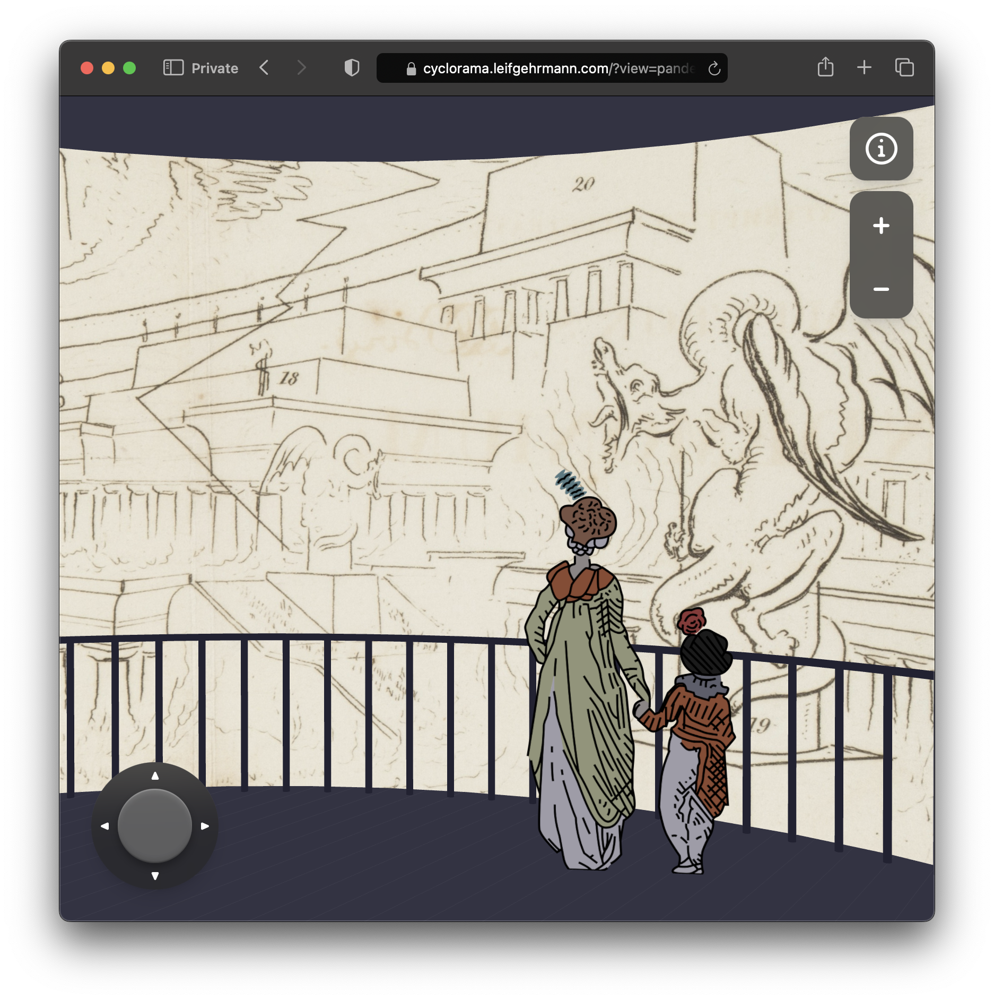
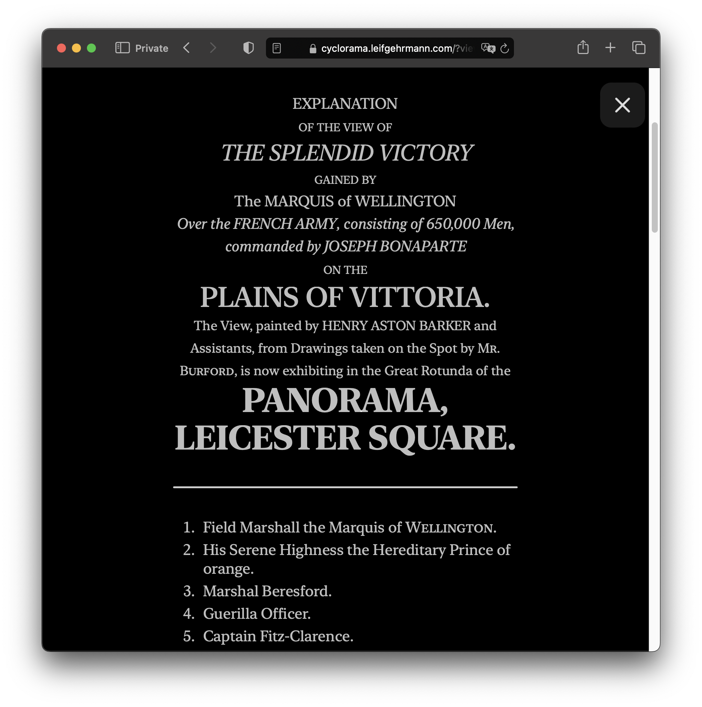

# Cyclorama

Virtual cycloramas of 19th-century panoramas.

View the project at: [cyclorama.leifgehrmann.com/](https://cyclorama.leifgehrmann.com/)

## Screenshots

|                                                                                                                                                                                                                                                          |                                                                                                                                                          |
|----------------------------------------------------------------------------------------------------------------------------------------------------------------------------------------------------------------------------------------------------------|----------------------------------------------------------------------------------------------------------------------------------------------------------|
|  |  |
|                                                                          |                                                         |

## Development

For development, use `npm run dev` to start a dev server.

To build and preview a production build, use `npm run build` and `npm run preview`. 

Every scene is defined in `src/scenes.ts`.
